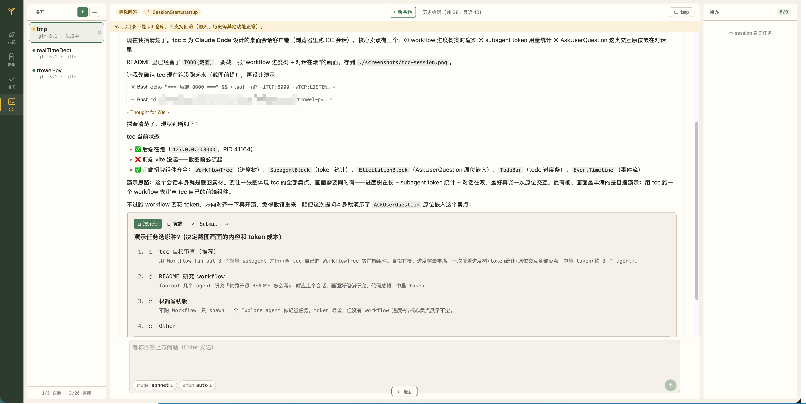

<p align="center"><strong>trowel</strong> 把 AI 编程会话，沉淀成会复利的记忆。</p>

<p align="center">
  
</p>

你在 tcc 里跟 Claude Code 干活，会话里值得记住的东西被 memory 层自动提炼——下次开启新的会话，大模型会带上历史记忆。

---

## 它能做什么

### tcc
为 Claude Code 做的桌面会话界面。目前前端的适配只覆盖了作者日常中需要用到的功能，例如提问框、workflow等。使用过程中遇到适配问题，欢迎提交issue和PR。

### memory
从会话里自动提炼日记和笔记，供tcc更好的解决新的问题。

### review
通过大模型提炼会话内容以及粘贴的内容，形成知识卡片，可供用户复习。

### garden
展示由你的知识卡片组成的花园。

## 跑起来

需要 [uv](https://docs.astral.sh/uv/) 和 Node.js。

后端：

```bash
uv sync
cp config.example.toml config.toml
# 编辑 config.toml，填你的 LLM api_key 和 base_url
uv run trowel-py
```

前端（另开一个终端）：

```bash
cd web && npm install && npm run dev
```

> 这是个个人工具，优先服务我自己的日常，不保证开箱即用。

## 技术栈

后端 FastAPI + sqlite + Pydantic v2，前端 React 19 + Vite + Zustand + framer-motion，模型走 Anthropic 兼容 API。

MIT 协议，见 [LICENSE](./LICENSE)。
