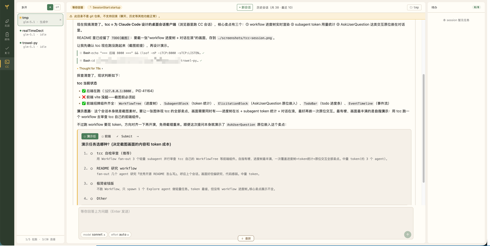

<p align="center"><strong>trowel</strong> 把 AI 编程会话沉淀成可复用的长期记忆。</p>

<p align="center">
  
</p>

Trowel 是本地桌面工具。它托管 Claude Code 会话，从会话中提炼日记和笔记，并在后续会话中提供相关记忆。

## 主要功能

- **tcc**：Claude Code 的桌面会话界面，支持消息、工具调用、提问、workflow 和历史恢复；
- **memory**：从会话中提炼可追溯的日记与笔记，并提供检索；
- **review**：把会话或粘贴内容整理成复习卡片；
- **garden**：用知识花园展示卡片和复习状态。

## 本地运行

需要 Python 3.13、[uv](https://docs.astral.sh/uv/) 和 [Bun](https://bun.sh/)。

后端：

```bash
uv sync
cp config.example.toml config.toml
# 在 config.toml 中填写所用模型服务的 api_key 和 base_url
uv run trowel-py
```

前端开发服务器：

```bash
cd web
bun install --frozen-lockfile
bun run dev
```

前端开发服务器会把 `/api` 转发到 `http://localhost:8000`。

桌面开发模式会自动启动随机端口的 Vite、Electron 和 Python sidecar：

```bash
cd web
bun install --frozen-lockfile
bun run desktop:dev
```

该命令使用当前源码目录作为开发数据目录。可安装的 macOS 应用包、签名和公证由
后续发布流程生成；普通浏览器开发入口继续保留。

单进程运行需要先构建前端。以下命令在已激活的 Python 3.13 环境中执行
editable install：

```bash
./scripts/build-package.sh
python -m pip install -e .
trowel-py
```

更新已有的 `main` 副本时，使用快进更新保留本地改动保护：

```bash
git switch main
git fetch origin
git merge --ff-only origin/main
./scripts/build-package.sh
python -m pip install -e .
```

`git reset --hard origin/main` 会永久丢弃未提交改动，不作为常规更新方式。

## 技术栈

- 后端：FastAPI、sqlite3、Pydantic v2；
- 前端：React 19、Vite、Zustand、framer-motion；
- 模型：Anthropic 兼容 API。

开发与提交规则见 [CONTRIBUTING.md](./CONTRIBUTING.md)。

MIT License，见 [LICENSE](./LICENSE)。
